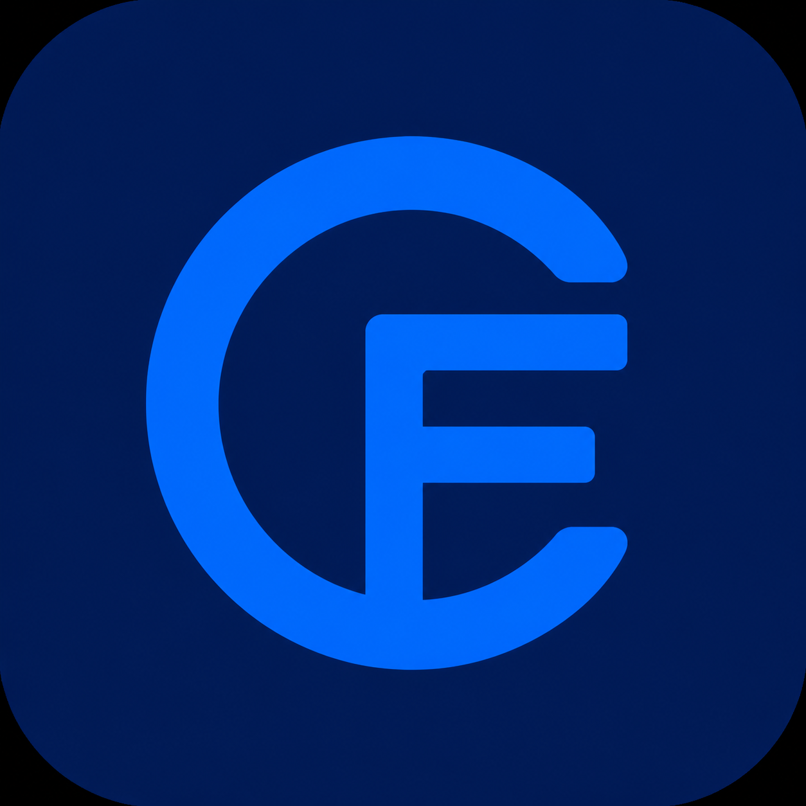
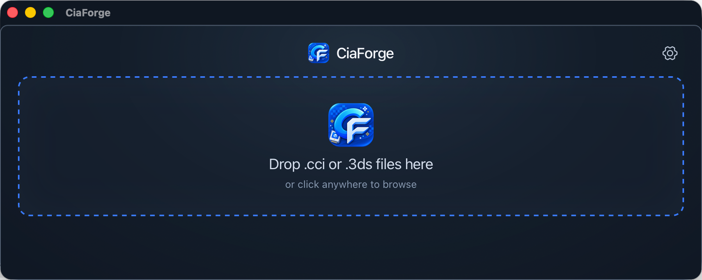
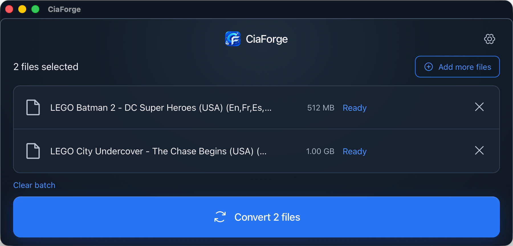

<p align="center">
  
</p>

# CiaForge

CiaForge is a focused Tauri desktop app for converting supported Nintendo 3DS
`.cci` and `.3ds` images to `.cia`. It pairs a native file picker and
drag-and-drop queue with a Rust conversion engine.

> Use only files you are legally entitled to convert and install. CiaForge does
> not include game content, keys, or firmware material.

## Usage

### macOS

Because I do not currently have an Apple Developer account, the macOS builds
are ad-hoc signed and not notarized. macOS may therefore report a downloaded
app as damaged or reject it through Gatekeeper.

After moving `CiaForge.app` to `/Applications`, open Terminal and run:

```bash
xattr -dr com.apple.quarantine "/Applications/CiaForge.app"
open "/Applications/CiaForge.app"
```

These commands remove the download quarantine attribute for CiaForge only and
open the app. They do not disable Gatekeeper system-wide. Only use an artifact
that you built yourself or obtained from a repository you trust.

### Convert a file

1. Open CiaForge.
2. Drag one or more `.cci` / `.3ds` files into the window, or select them with
   the file browser.
3. Choose the output location in **Settings** if needed.
4. Start the conversion and find the generated `.cia` file next to the source
   file or in the shared output folder.

### Testing status and feedback

I currently have only one Apple Silicon (ARM64) MacBook available. I can test
the macOS arm64 build, but I cannot currently test the macOS x86_64 or Windows
builds. If you have an Intel Mac or a Windows PC, please help test them and
report the operating system version, CPU architecture, app version, and any
error messages.

## Screenshots

<p align="center">
  
</p>

<p align="center"><em>Empty state with drag-and-drop import.</em></p>

<p align="center">
  
</p>

<p align="center"><em>Conversion queue with multiple files selected.</em></p>

## Features

- Drag in one or many `.cci` / `.3ds` files, or select them from the native
  file browser.
- See file names, sizes, conversion status, per-file progress, and full error
  details on hover when text is truncated.
- Choose a single output policy in Settings: next to each source file (default)
  or one shared output folder.
- Add more files before a batch begins; clear the batch to return to the import
  screen.
- Keep conversion sequential and prevent duplicate batch starts while a batch
  is running.
- Avoid overwrites automatically: `Game.cia`, `Game_1.cia`, `Game_2.cia`, and
  so on.
- Reveal a successfully converted file in Finder.
- Switch the interface between English and Simplified Chinese.

## Current support and limits

The current Rust engine supports **unencrypted** NCCH content inside `.cci` or
`.3ds` images. It validates CCI/NCCH structure, patches required CIA metadata,
and writes CIA content records with SHA-256 integrity data.

Original-NCCH and zero-key encrypted inputs are detected but are not supported
yet. They fail with a clear per-file error instead of producing a partial CIA.

## Development

### Prerequisites

- A current Node.js LTS release and npm
- A current stable Rust toolchain
- The native build prerequisites required by [Tauri v2](https://v2.tauri.app/start/prerequisites/)

### Run locally

```bash
npm install
npm run tauri dev
```

### Verify

```bash
npm run build
cargo test --manifest-path src-tauri/Cargo.toml
```

### Build a distributable application

```bash
CI=false npm run tauri -- build --target aarch64-apple-darwin --bundles dmg
```

Use `x86_64-apple-darwin` instead of `aarch64-apple-darwin` for an Intel Mac.
The DMG is written beneath `src-tauri/target/<target>/release/bundle/dmg/`;
these generated files are intentionally ignored by Git.

## GitHub Actions builds

The workflow at [`.github/workflows/build-desktop.yml`](.github/workflows/build-desktop.yml)
builds separate macOS arm64 and x86_64 DMGs, plus the existing Windows bundle.
It runs for pull requests, manual dispatches, and tags beginning with `v` (for
example, `v0.2.0`). Each run uploads three downloadable artifacts:

- `CiaForge-macOS-arm64` (DMG)
- `CiaForge-macOS-x86_64` (DMG)
- `CiaForge-Windows` (EXE)

When a version tag is pushed, a separate release job downloads the build
artifacts and publishes the two macOS DMGs plus the Windows `.exe` installer to
the matching GitHub Release. The macOS DMGs use an ad-hoc signature for bundle
integrity, but are not notarized without Apple signing secrets.

## Repository layout

```text
src/                       Frontend state, interactions, and styles
src-tauri/src/              Tauri commands and Rust conversion engine
src-tauri/assets/           Runtime CIA template assets
src-tauri/capabilities/     Tauri permissions
src-tauri/icons/            Application icons used for bundling
public/                     Frontend static assets
docs/screenshots/           README screenshots (not bundled with the app)
```

See [ARCHITECTURE.md](ARCHITECTURE.md) for module responsibilities and the
conversion flow.

## Third-party attribution

The conversion behaviour and embedded retail CIA templates are derived from
[ihaveamac/3dsconv](https://github.com/ihaveamac/3dsconv). CiaForge does not
execute or bundle the Python project. See [THIRD_PARTY_NOTICES.md](THIRD_PARTY_NOTICES.md)
for the required attribution and license text.

## License

MIT. See [LICENSE](LICENSE).
